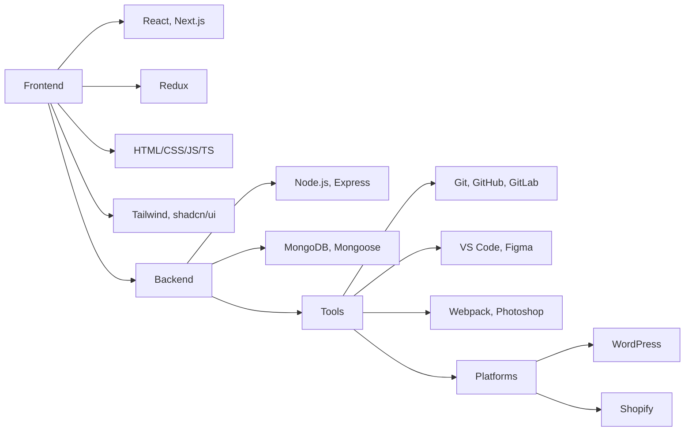

  <!-- 🔥 Animated Gradient Name -->
  <h1>
   👨 Ahadul Islam 
  </h1>

  <!-- 🔧 Tagline / Identity Badge -->
  

    <h3 style="margin: 0; font-weight: 400; display: flex; align-items: center; gap: 10px; font-size: 1.1rem;">
      👨‍💻 Full Stack Web Wizard &nbsp;|&nbsp; 🔓 Open Source Addict &nbsp;|&nbsp; 🎨 UI Lover
    </h3>
  

  <!-- ⚡ Typing Animation -->
  

    
  

  <!-- Quick Intro Blurb -->
  

    I transform complex problems into elegant solutions through code. With expertise in both frontend and backend development, I create seamless digital experiences that users love. When I'm not coding, you'll find me contributing to open-source projects or mentoring aspiring developers.
  

  <!-- Animated Border Separator -->
  

  
  
  

  

