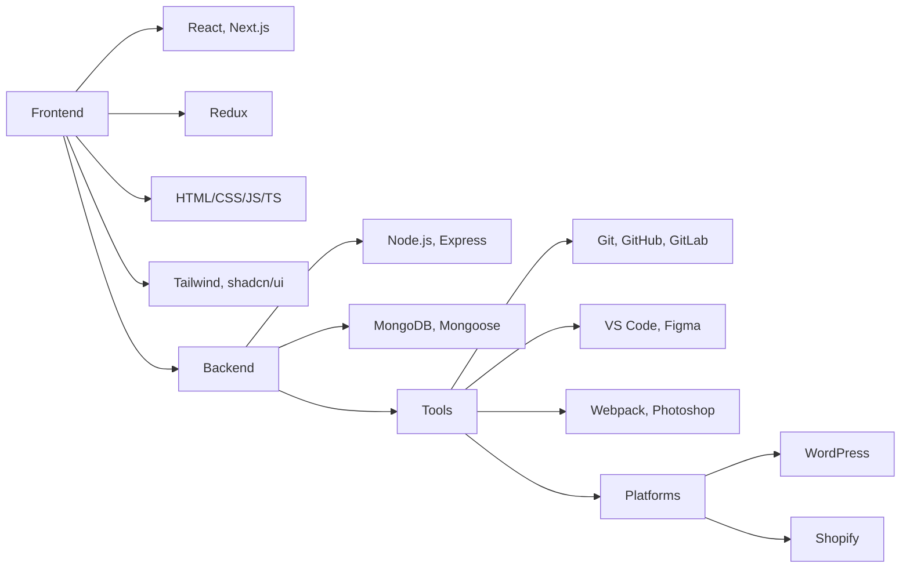

  <!-- Animated Gradient Name -->
  <h1 style="font-size: 3rem; margin: 0; background: linear-gradient(90deg, #ff8a00, #e52e71, #b36bff); -webkit-background-clip: text; -webkit-text-fill-color: transparent; animation: gradientShift 5s ease infinite; background-size: 200% 200%;">
    Hello, I'm Ahadul Islam 👋
  </h1>
  <!-- Professional Tagline with Icon -->
  

    <h3 style="margin: 0; font-weight: 400; display: flex; align-items: center; gap: 8px;">
      👨‍💻 
      Full Stack Developer | 
      Open Source Contributor | 
      Digital Craftsman
    </h3>
  

  <!-- Personalized Typing Animation -->
  

    
  

  <!-- Quick Intro Blurb -->
  

    I transform complex problems into elegant solutions through code. With expertise in both frontend and backend development, I create seamless digital experiences that users love. When I'm not coding, you'll find me contributing to open-source projects or mentoring aspiring developers.
  

  <!-- Animated Border Separator -->
  

  
  
  

  

